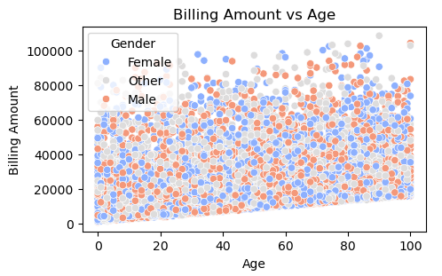
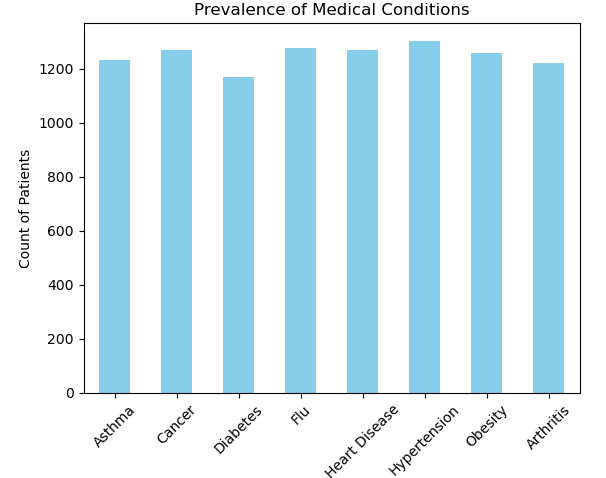

# Healthcare Data Analysis: Billing, Satisfaction, and Revisit Prediction


_Disclaimer
This project uses a synthetic healthcare dataset created for educational purposes only. The data is entirely fictional and does not represent real patient information. It is used to showcase technical skills in data analysis, business intelligence, and big data applications. Real healthcare data is subject to strict privacy regulations and ethical considerations, which is why synthetic data is used here to avoid privacy concerns. The insights and recommendations are based on simulated data and serve to demonstrate my proficiency in data science methodologies._

---


## Project Overview
This project analyzes **synthetic** healthcare data to derive actionable insights, optimize resource allocation, and improve hospital operations. The analysis focuses on patient demographics, billing trends, satisfaction scores, revisit flags, and other key metrics. By simulating real-world scenarios with added **skewness** and **noise**, the project demonstrates technical proficiency, business intelligence, and the ability to solve real-world problems.

### Dataset Description

Key features of the dataset include:
- Patient Information: Age, gender, blood type, medical condition, length of stay.
- Hospital Data: Admission type, room number, doctor assigned, satisfaction score.
- Financial Details: Billing amount, insurance provider.
- Outcomes: Discharge status, revisit flags.

  ### Objectives
- Understand Patient Trends: Analyze billing amounts, length of stay, and revisit rates for actionable patterns.
- Enhance Resource Allocation: Identify high-demand medical conditions for better resource planning.
- Improve Patient Satisfaction: Explore factors influencing satisfaction to enhance hospital services.
- Bridge Data and Decision-Making: Use insights to recommend strategies that align with hospital goals.

### Key Features
#### 1. Data Processing and Cleaning
##### Tools Used: Pandas, NumPy
- Handled missing values and standardized dataset columns for consistency.
- Encoded categorical variables for analysis and modeling.

#### 2. Simulating Real-World Complexity
- Added skewness and noise to variables like Length of Stay and Billing Amount to mimic real-world inconsistencies.
- Adjusted values based on patient age and medical condition to reflect plausible billing and resource scenarios.

**_Python Code & EDA Snippet_**
 
  ```
  import numpy as np

# Mapping conditions for the new structure
conditions = ['Asthma', 'Cancer', 'Diabetes', 'Flu', 'Heart Disease', 'Hypertension', 'Obesity']

# Age-Based Adjustments
df['Billing Amount'] = df['Billing Amount'] + df['Age'] * 50  # Older patients billed more
df['Length of Stay'] = df['Length of Stay'] + np.where(df['Age'] > 50, 2, 0)  # Longer stay for older patients

# Condition-Based Adjustments (use the 'Medical Condition' column)
for condition in conditions:
    # Apply adjustments based on the medical condition
    df['Billing Amount'] = np.where(df['Medical Condition'] == condition, df['Billing Amount'] + 500, df['Billing Amount'])
    df['Length of Stay'] = np.where(df['Medical Condition'] == condition, df['Length of Stay'] + 3, df['Length of Stay'])

    if condition == 'Flu':
        df['Billing Amount'] = np.where(df['Medical Condition'] == condition, df['Billing Amount'] - 200, df['Billing Amount'])
        df['Length of Stay'] = np.where(df['Medical Condition'] == condition, df['Length of Stay'] - 2, df['Length of Stay'])

# Satisfaction Score Adjustments
df['Satisfaction Score'] = df['Satisfaction Score'] - df['Length of Stay'] * 0.2
df['Satisfaction Score'] = np.clip(df['Satisfaction Score'], 1, 10)  # Clamp scores between 1 and 10

# Revisit Flag Adjustments
df['Revisit Flag'] = np.where(
    (df['Medical Condition'] == 'Asthma') | (df['Medical Condition'] == 'Diabetes'), 1, df['Revisit Flag']
)  # Chronic conditions lead to revisits
df['Revisit Flag'] = np.where(df['Medical Condition'] == 'Flu', 0, df['Revisit Flag'])  # Acute conditions less likely

# Add Some Noise to Make It Realistic
df['Billing Amount'] += np.random.normal(0, 100, size=len(df))
df['Length of Stay'] += np.random.normal(0, 1, size=len(df))

# Check your data after changes
print(df.head())
```
_This code adjusts the Billing Amount, Length of Stay, and Satisfaction Score based on factors like patient age and medical conditions. It also modifies the Revisit Flag for chronic conditions and introduces some random noise to make the data more realistic, simulating real-world variations in healthcare billing and patient stay_

Link to Full Python Project here: https://github.com/Michael-Otebola/Healthcare-Data-Analysis-Project/blob/47bf7fbf3ffeaeab53e0c9ef1166f0dd191409a9/Improving%20Patient%20Outcomes%20through%20Data%20Analysis.ipynb

---

#### 3. Exploratory Data Analysis (EDA)
**1. Billing Trends:**
- Older patients have higher billing amounts, often due to extended stays and complex care needs.
- Recommendation: Develop cost-effective care programs for aging populations.

  

_Figure 1: A scatter plot showing the relationship between patient Age and Billing Amount, indicating that older patients incur higher billing costs._

---

**2. Length of Stay:**
- Chronic conditions (e.g., Cancer, Heart Disease) result in the longest stays, while acute conditions (e.g., Flu) are resolved quickly.
- Recommendation: Allocate resources effectively to balance chronic and acute case management.

**3. Patient Satisfaction:**
- Satisfaction scores decrease with longer hospital stays.
- Recommendation: Implement measures to enhance communication and comfort during extended admissions.

**4. Revisit Rates:**
- Chronic conditions like Asthma and Diabetes have high revisit rates.
- Flu patients also revisit frequently, likely due to seasonal outbreaks.
- Recommendation: Strengthen follow-up care for chronic and acute conditions


**5. Prevalence and Severity:**
- Common conditions: Hypertension and Asthma.
- Resource-intensive conditions: Cancer and Heart Disease.
- Recommendation: Focus preventive care on common conditions and allocate specialized resources to severe cases.

  

_Fig. 2 A Bar Chart Showing the Severity of Medical Condition_

#### 4. Statistical Insights
- Correlation analysis revealed key relationships, such as the negative impact of Length of Stay on Satisfaction Scores.
- Identified high revisit rates for chronic conditions like Diabetes and Asthma, as well as acute surges for Flu patients.

  

 ### Overall Insights and Recommendations
**1. Billing Trends**

**Insight**: Older patients and those with chronic conditions like Cancer and Heart Disease incur significantly higher bills.

**Recommendation**: Develop chronic care programs tailored to these patients, improving outcomes and managing costs.

**2. Length of Stay**

**Insight**: Patients with severe conditions (e.g., Cancer) have longer stays, while Flu patients leave sooner.

**Recommendation**: Prioritize resources for chronic cases while maintaining efficiency for acute cases.

**3. Patient Satisfaction**

**Insight**: Satisfaction decreases with longer stays, reflecting potential dissatisfaction or unmet expectations.

**Recommendation**: Enhance patient experience through improved communication, comfort measures, and personalized care.

**4. Revisit Trends**

**Insight**: Chronic conditions have consistently high revisit rates, with Flu contributing to seasonal spikes.

**Recommendation**: Implement post-discharge programs and follow-ups for both chronic and acute patients to reduce readmissions.

**5. Resource Allocation**

**Insight**: Common conditions like Hypertension and Asthma are prevalent, but severe cases like Cancer require intensive resources.

**Recommendation**: Invest in preventive care for common conditions and allocate specialized resources for severe cases.


## Technical Implementation
- This analysis was conducted using Python, leveraging libraries like Pandas, NumPy, Matplotlib, and Seaborn for:
- Dataset Source: Synthetic healthcare dataset with realistic complexity.
- Data Preprocessing: Cleaning, handling missing data, and creating new features.
- Exploratory Analysis: Visualizing trends, anomalies, and correlations.
- Synthetic Adjustments: Adding noise and skewness to mimic real-world data challenges.
- Visualization: Graphs and heatmaps to communicate findings.

 ## Acknowledgments
Special thanks to OpenAI's ChatGPT for guidance and idea refinement during this project.

## Next Steps
- Incorporate advanced predictive modeling for patient satisfaction and revisit probabilities.
- Validate findings with real-world datasets.
- Develop operational optimization strategies based on derived insights.

